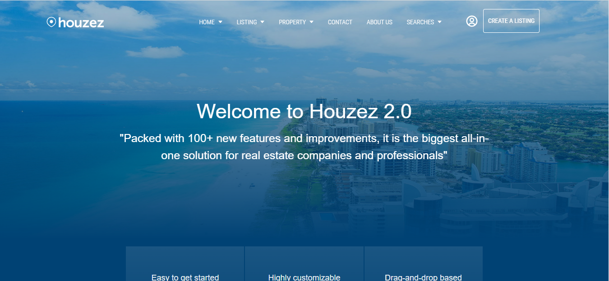

# Houzez-Real-Estate-React

> Property website-listing different properties for rent and sale.

As mentioned, the website lists unique properties for rent and for sale. We have three functional nav sections which are:

Home: The main page of the website where you can find all the unique properties along with the contact info of the sales agents.

Contact: Where our offices are located, including the detailed contact information.

About us: A bit additional information about the company and the many types of services provided.

## Built With

- HTML5
- CSS3
- JavaScript
- React.js
- styled-components
- tailwind-css
- react-router-dom
- react-slidesshow-image
- react-google-maps
- react-slick
- react-slick-carousel
- react-icons

## Live Demo

[Live Demo Link](https://houzez-real-estate-react.netlify.app/)

## Getting Started

**This is an example of how you may give instructions on setting up your project locally.**
**Modify this file to match your project, remove sections that don't apply. For example: delete the testing section if the currect project doesn't require testing.**

- To get a local copy up and running follow these simple example steps.

### Prerequisites

- You need npm to be installed on your local machine. For details please use the following site :https://docs.npmjs.com/downloading-and-installing-node-js-and-npm

### Setup

- Next you need to clone the repository on your local machine with the following command line:
  git clone https://github.com/bdimoski/Houzez-.git

### Install

- To install the project you need to enter the directory you've cloned. Open a terminal and follow these next steps:
- npm install (to install all the necessary modules and dependencies);

### Usage

- To run this project localy simply run the following line:

npm start;

- And the project should be deployed on your machine and you can access it on a browser by default on the URL: localhost:3000

## �� Contributing

Contributions, issues, and feature requests are welcome!

Feel free to check the [issues page](issues/).

## Show your support

Give a ⭐️ if you like this project!

## Acknowledgments

- https://default.houzez.co/

## �� License

This project is [MIT](lic.url) licensed.
